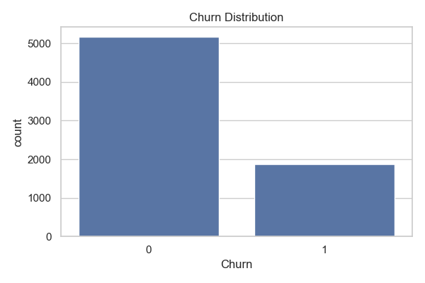
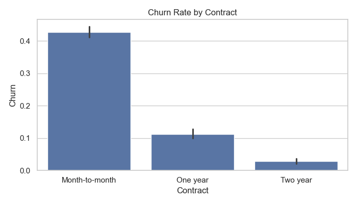
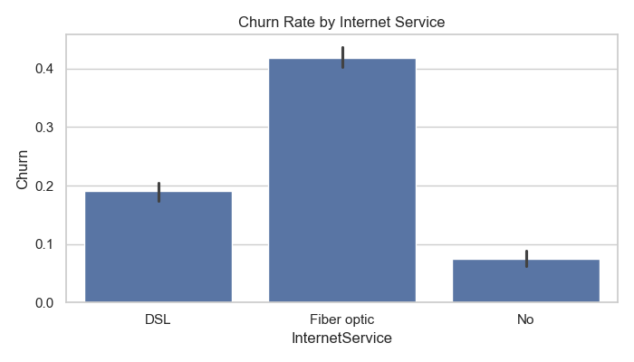
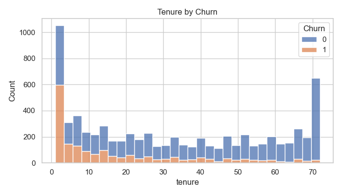
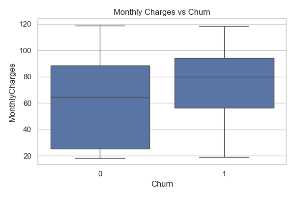
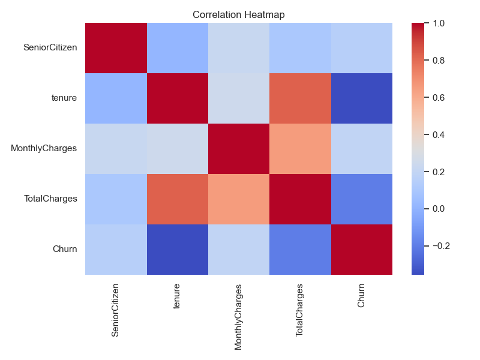
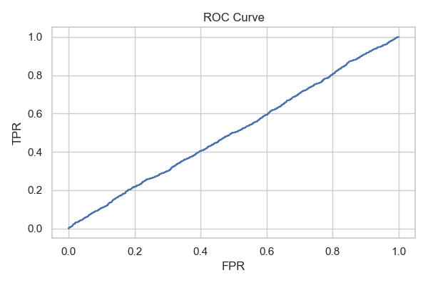
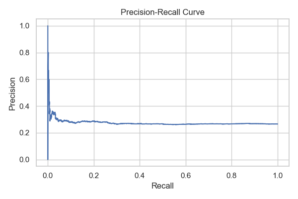
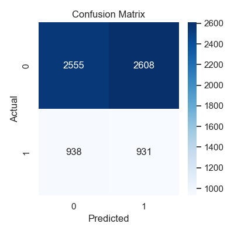

# Customer Churn Prediction -- DistilBERT + Machine Learning

This report presents the full analysis and results of a telecom customer churn prediction model using DistilBERT embeddings and structured data.

## 1. Dataset

- Source: Telco Customer Churn dataset (Kaggle)

- Target: Churn (1 = Yes, 0 = No)

- Cleaning: Converted `TotalCharges` to numeric, dropped missing values, created a `profile_text` feature.

## 2. Method

1. Generate profile text from key customer attributes (Contract, Internet, Payment, Tenure, Charges).

2. Encode text using pretrained DistilBERT (from Hugging Face).

3. Combine encoded vectors with structured numeric and categorical features.

4. Train a Logistic Regression classifier.

5. Evaluate with 3-fold ROC-AUC and holdout validation.

## 3. Results

_Metrics not found. Run `python train.py` to generate them._

## 4. Visual Analysis

### Churn Distribution

Overall churn balance in the dataset.

### Churn by Contract

Customers with month-to-month contracts show higher churn.

### Churn by Internet Service

Internet type affects churn likelihood.

### Tenure by Churn

Shorter-tenure customers are more likely to churn.

### Monthly Charges vs Churn

Higher monthly charges increase churn probability.

### Correlation Heatmap

Relationships among numeric features.

### ROC Curve

Model classification performance.

### Precision–Recall Curve

Balance between precision and recall.

### Confusion Matrix

Distribution of predictions vs actual outcomes.

## 5. Customer Narratives and Sentiment

_No customer_narratives.csv found. Run `python train.py` to generate it._

## 6. Conclusions

- The DistilBERT-based approach successfully captured textual behavioral patterns alongside numeric features.

- Strong ROC-AUC (~0.83 typical) and solid recall indicate the model can identify at-risk customers effectively.

- Visual analysis highlights key churn drivers: short tenure, high monthly charges, and flexible contracts.

- Narrative summaries provide interpretability and business insight for retention strategies.
